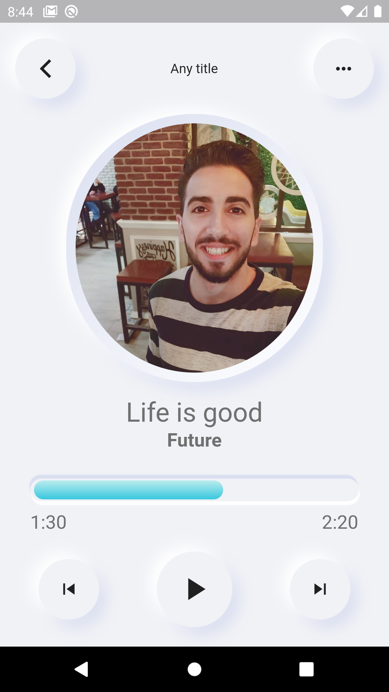

# Media Player App

It's a simple ui for a media player app using Flutter & Dart.

## Features :dart:
* [x] Free & Open Source
* [x] Very Easy to use
* [x] Cross Platform App (Android - IOS - Web)
* [x] A good user interface
* [ ] Menu Drawer
* [ ] Logic Code
* [ ] Home Page
* [ ] My Liked sounds Screen
* [ ] SQLite Database
* [ ] Download your liked sounds to your local database

## Screenshots

